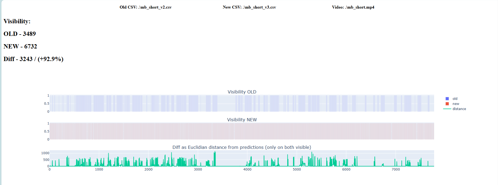
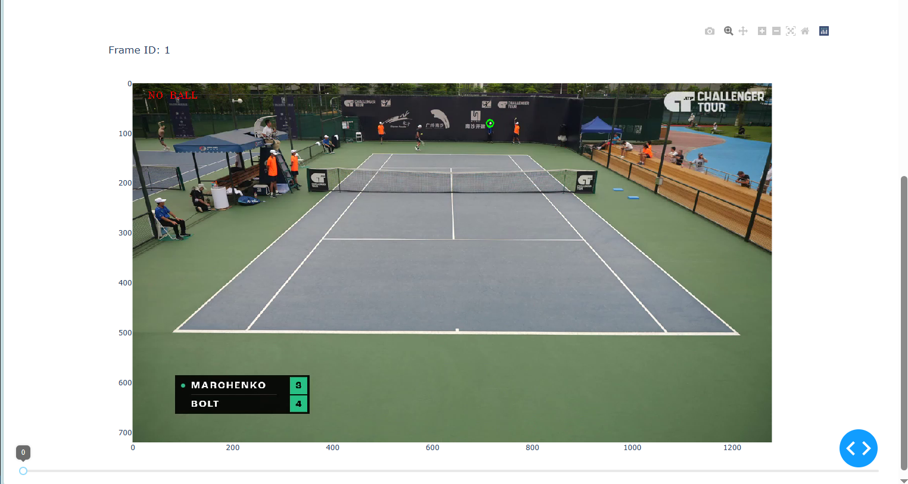

# Tracknet error analyser tool

## Install

*Python 3.9.4*

  1) Create venv and activate
     
     ```
     python -m venv .venv
     ```
     Windows:
     ```
     .venv\Scripts\activate
     ```
  
  2) Install packages

     ```
     pip install -r req_final.txt
     ```

  3) Run with parameters

      ```
      python main_tool.py --file /path/to/.mp4 --old /path/to/old.csv --new /path/to/new.csv
      ```

  4) Open browser [web page](http://127.0.0.1:8050/)

## Demo




